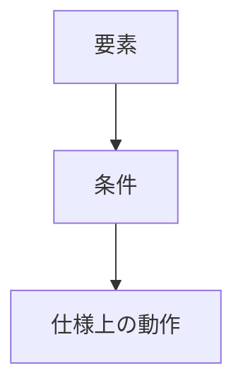

# 警告・学習記録テンプレート

**テーマ:**  
（例）meta viewport 警告の理解と対応

**日付:** YYYY/MM/DD  
**環境:** OS / エディタ / ブラウザ など

---

## 1. 📍 発生した事象または警告

### 内容

> （警告文または現象の要約）

```json
[
  {
    "resource": "",
    "message": "",
    "source": ""
  }
]
```

---

## 2. 🧩 原因分析

- 発生条件やツールの動作を記述
- HTML / CSS / JS / PHP など、どのレイヤーかを明示

---

## 3. 🧠 背景知識・参考資料

- [WHATWG 仕様リンク]()
- [MDN 解説リンク]()
- [その他資料]()

---

## 4. ⚠️ 対応前コード

```html
<!-- 修正前のコード -->
```

---

## 5. ✅ 改善後コード

```html
<!-- 修正後のコード -->
```

---

## 6. 🧾 ツール・警告メッセージの補足

> 警告ツール（例：Edge DevTools / Webhint / ESLint など）  
> の意味を自分の言葉でまとめる

---

## 7. 🧩 関連仕様や動作図



---

## 8. 🧰 環境情報

| 項目     | 値  |
| -------- | --- |
| OS       |     |
| エディタ |     |
| ブラウザ |     |
| 拡張機能 |     |

---

## 9. 💬 まとめ

| 観点     | 要約 |
| -------- | ---- |
| 発生原因 |      |
| 根本要因 |      |
| 対処法   |      |
| 学び     |      |
| 補足     |      |

---

## 🧭 振り返りメモ

- どのように気づいたか
- 今後に活かす点
- 他言語・他環境にも応用できそうか

---
