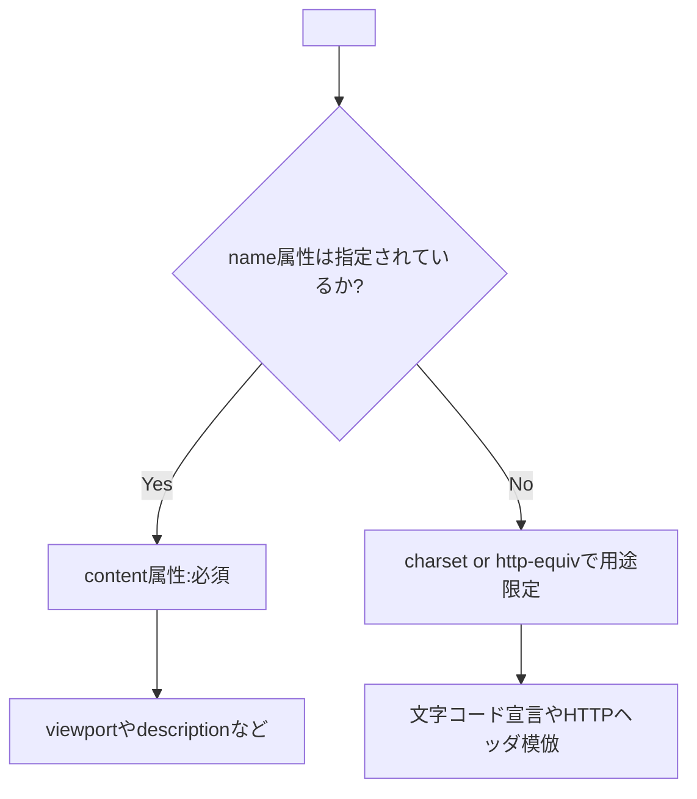

# viewport 警告と meta タグ

**テーマ:** meta viewport 警告の理解と対応  
**日付:** 2025/11/08(土)  
**環境:** Windows 11 / VSCode / Edge DevTools

---

## 1. 📍 発生した警告

### 警告内容

> A 'viewport' meta element was not specified.  
> (HTML にビューポート指定がない為、レスポンシブデザインの観点から期待する描画がされない可能性がある)

```json
[
  {
    "resource": ".../index.html", //フルパスなのでマスキングしてます.
    "owner": "_generated_diagnostic_collection_name_#4",
    "code": { "value": "meta-viewport" },
    "severity": 8,
    "message": "A 'viewport' meta element was not specified.",
    "source": "Microsoft Edge Tools"
  }
]
```

---

## 2. 🧩 原因分析

- Edge DevTools（拡張機能）には **Webhint** が組み込まれている。
- Webhint は HTML の構文エラーではなく、**Web 標準とベストプラクティスの観点**から警告を出す。
- 今回の警告は、HTML 仕様における **`<meta name="viewport">` の欠落** が原因。

---

## 3. 🧠 背景知識：viewport とは？

**viewport（ビューポート）** とは、ブラウザ上でユーザーに実際に表示される領域のこと。  
スマートフォンやタブレットでは、画面幅に応じたレイアウトを行うために  
`<meta name="viewport">` の指定が必要となる。

### 参考資料

- [WHATWG HTML Living Standard — The meta element](https://html.spec.whatwg.org/multipage/semantics.html#the-meta-element)
- [MDN Web Docs — <meta name="viewport">](https://developer.mozilla.org/ja/docs/Web/HTML/Reference/Elements/meta/name/viewport)
- [Webhint — hint-meta-viewport](https://webhint.io/docs/user-guide/hints/hint-meta-viewport/)

---

## 4. ⚠️ 対応前コード

```html
<!DOCTYPE html>
<html lang="ja">
  <head>
    <meta charset="utf-8" />
    <title>Sample</title>
  </head>
  <body>
    ...
  </body>
</html>
```

結果：  
Webhint より「A 'viewport' meta element was not specified.」警告が発生。

---

## 5. ✅ 改善後コード

### 修正版 1（誤構文例）

```html
<meta charset="utf-8" name="viewport" />
```

→ ❌ **誤り**：`charset` と `viewport` は別タグとして記述する必要あり。

> _"attribute, and the file's character encoding declaration when an HTML document is serialized to string form (e.g. for transmission over the network or for disk storage) with the charset attribute.Exactly one of the name, http-equiv, charset, and itemprop attributes must be specified.If either name, http-equiv, or itemprop is specified, then the content attribute must also be specified. Otherwise, it must be omitted.The charset attribute specifies the character encoding used by the document. This is a character encoding declaration. If the attribute is present, its value must be an ASCII case-insensitive match for the string "utf-8"."_  
> — [HTML Living Standard The meta element](https://html.spec.whatwg.org/multipage/semantics.html#the-meta-element)

---

### 修正版 2（正しい例）

```html
<!DOCTYPE html>
<html lang="ja">
  <head>
    <meta charset="utf-8" />
    <meta name="viewport" content="width=device-width, initial-scale=1.0" />
    <title>Sample</title>
  </head>
  <body>
    ...
  </body>
</html>
```

結果：  
✅ 警告が消失し、モバイル端末での表示が自然なスケールに。

#### 補足

💡 Webhint の [hint-meta-viewport](https://webhint.io/docs/user-guide/hints/hint-meta-viewport/#page-heading)
では `initial-scale=1` を使用することも勧めている。
(iOS 9 以前の Safari の方向変更バグを回避するために必要らしい…)

> _"One common problem on iOS is that, when you use a meta viewport tag with , the page doesn’t react to an orientation change. On the iPhone the page becomes 320px wide and on the iPad 768px, regardless of whether you’re in portrait or in landscape mode. Sometimes this is annoying. width=device-width"_  
> — [initial-scale=1 makes Safari iOS react to orientation change](https://www.quirksmode.org/blog/archives/2013/10/initialscale1_m.html)

---

## 6. 🧾 Webhint 上の追加警告と解釈

[修正版 1](#修正版1誤構文例)で `name="viewport"` を追加した際、次の警告が発生した：

```json
"The 'viewport' meta element should have a non-empty 'content' attribute."
```

### 意味

- 仕様上 `content` 属性は省略可能だが、
- **`name`, `http-equiv`, `itemprop` のいずれかを指定した場合は `content` が必須**（WHATWG 仕様による定義）。

> _"If either name, http-equiv, or itemprop is specified, then the content attribute must also be specified."_  
> — [HTML Liveing Standard The meta element](https://html.spec.whatwg.org/multipage/semantics.html#the-meta-element)

---

## 7. 🧩 仕様から見た「meta 要素」の定義図



---

## 8. 🧰 環境情報

| 項目     | 値                                     |
| -------- | -------------------------------------- |
| OS       | Windows 11 ver.21H2 (Build 22000.2538) |
| エディタ | VSCode v1.105.1                        |
| 拡張機能 | ms-edgedevtools.vscode-edge-devtools   |
| ブラウザ | Microsoft Edge v142.0.3595.53 (64bit)  |

---

## 9. 💬 まとめ

| 観点     | 要約                                                                            |
| -------- | ------------------------------------------------------------------------------- |
| 発生原因 | `<meta name="viewport">` の欠落                                                 |
| 根本要因 | 構文的には問題ないが、Webhint 上の UX 推奨違反                                  |
| 対処法   | `<meta name="viewport" content="width=device-width, initial-scale=1.0">` を追加 |
| 学び     | Webhint の警告は「動作エラー」ではなく「改善提案」                              |
| 補足     | WHATWG 仕様では `name` 属性を指定した場合、`content` は必須                     |

---

## 🧭 振り返りメモ

- Webhint の警告は HTML 構文の誤りではなく「ベストプラクティス違反」。
- WHATWG 仕様と MDN の両方を参照すると、仕様と実践を区別して理解できる。
- 今後は HTML 構文チェック（validator）と Webhint 警告（UX 改善）を分けて見る。

---
